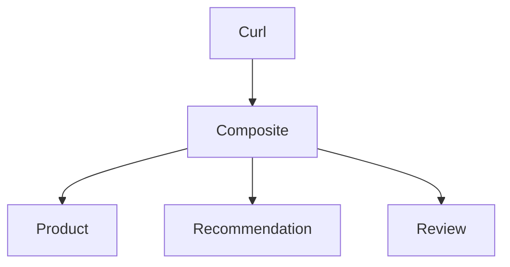

# 1. Overview



The Composite service calling the core services uses:
1. Using Virtual Threads with Structured Concurrency
1. Using Interface Clients and RestClients

Three variants:
1. `sequential` - Sequential with Interface Clients
1. `interface-client` - Concurrent with Interface Clients
1. `rest-client` - Concurrent with RestClients

> **NOTE:** For simplicity, one API PRovider implementans all three core services

# 2. Build, run, and test

Run each command in a separate terminal:

```
./gradlew api-provider:bootRun
./gradlew api-consumer:bootRun
time ./test-all-clients.bash
```

Test script:
* [test all client types](./test-all-clients.bash)
* [test one client type](./test-one-client.bash)


# 3. Code changes

See [Spring Boot 4.0 Migration Guide](https://github.com/spring-projects/spring-boot/wiki/Spring-Boot-4.0-Migration-Guide)

## 3.1. Fine grained deps

Spring Boot 4 breaks up the monolithic `spring-boot-autoconfigure` jar into small and more focused modules. Intended goals are:
* Maintainability and architectural clarity 
* Reduced artifact sizes and footprint

Examples:

1. `RestCLient` and `WebCLient` no longer part of `spring-boot-starter-webmvc/webflux`, now they have their own starters
1. `@AutoConfigureWebTestClient` required to bind the `WebTestClient` to the test context.   
    It is no longer suffieicent to declare `@SpringBootTest(webEnvironment = RANDOM_PORT)` on the test class.
1. New test-dependencies required, e.g. `spring-boot-starter-webflux-test` and `spring-boot-starter-data-mongodb-test`
1. Package names follow the dependecy names more strictly, e.g. the class `DataMongoTest` is moved from:

       org.springframework.boot.test.autoconfigure.data.mongo
   To:

       org.springframework.boot.data.mongodb.test.autoconfigure
1. OTel et al dependencies are now part of a single dependency `spring-boot-starter-opentelemetry`

## 3.2. OpenRewrite to some help...

**TODO:** Try out on public repo for 4th edition
* Shortcomings: https://github.com/magnus-larsson/Microservices-with-Spring-Boot-and-Spring-Cloud-3E-INIT/issues/126#issuecomment-3810837234
* Files: /Users/magnus/Documents/projects/openrewrite/git/openrewrite-migrate-to-sb4/migrate-to-sb4-recipe/init.gradle
* Command:  ./gradlew --init-script migrate-to-sb4-recipe/init.gradle rewriteRun

## 3.3. Migrating from Jackson v2 to v3

1. Package rename from `com.fasterxml.jackson` to `tools.jackson`
2. Replaced `ObjectMapper` with `JsonMapper`.
3. Fewer checked exceptions are thrown by v3.

# 4. Smaller jars?

Fine grained dependencies, smaller jars?
Does the fine grained dependencies result in smaller jars?

SB 4.0.0:

```
spring init \
--boot-version=4.0.0 \
--type=gradle-project \
--java-version=25 \
--packaging=jar \
--name=sb400 \
--dependencies=web \
sb400

cd sb400
sdk use java 25-tem
./gradlew build
ls -al build/libs/sb400-0.0.1-SNAPSHOT.jar
cd ..
```

Results in:

```
-rw-r--r--@ 1 magnus  staff  19616003 Dec 17 09:00 build/libs/sb400-0.0.1-SNAPSHOT.jar
```

SB 3.5.8:

```
spring init \
--boot-version=3.5.8 \
--type=gradle-project \
--java-version=21 \
--packaging=jar \
--name=sb358 \
--dependencies=web \
sb358

cd sb358
sdk use java 21.0.3-tem
./gradlew build
ls -al build/libs/sb358-0.0.1-SNAPSHOT.jar
```

Results in:

```
-rw-r--r--@ 1 magnus  staff  21044297 Dec 17 09:01 build/libs/sb358-0.0.1-SNAPSHOT.jar```
```

**Result:** Only dropped from 21 to 19 MB...

# 5. Java AOT Cache

Faster startup with Java AOT Cache

...Java 25 AOT Cache, Build Packs

See https://github.com/magnus-larsson/Microservices-with-Spring-Boot-and-Spring-Cloud-3E-INIT/issues/113
See /Users/magnus/Documents/projects/cadec2026/SB4.0-bootcamp.pptx

Java 24 & 25 commands

BootBuildImage + config in build.gradle

Compare times with and without Docker...

> **NOTE:** Not the same as Spring AOT, see (and its limitations): https://docs.spring.io/spring-boot/reference/packaging/aot.html 

> **NOTE:** Watch out for libs that connect during startup, e.g. dbs and JWTS lookup

Spring-smoke-test project...

# 6. Null-safe application

TODO...

# 7. Observability

Dependency:

    implementation 'org.springframework.boot:spring-boot-starter-opentelemetry'

1. Enable tracing in `application.yml`:

       tracing.export.enabled: true

   * [consumer app-config](./api-consumer/src/main/resources/application.yaml)
   * [provider app-config](./api-provider/src/main/resources/application.yaml)


1. Start Jaeger for OpenTelemetry tracing

```
docker run -d --name jaeger \
  -p 16686:16686 \
  -p 4317:4317 \
  -p 4318:4318 \
  -p 5778:5778 \
  -p 9411:9411 \
  cr.jaegertracing.io/jaegertracing/jaeger:2.11.0
```

1. Restart the provider and consumer apps

Try out the three client types

```
curl localhost:7002/product-composite/sequential/2 -i
curl localhost:7002/product-composite/rest-client/2 -i
curl localhost:7002/product-composite/interface-client/2 -i
```

Check trace i Jaegers Web UI: http://localhost:16686

**Conslusion:** Context propagation currently does not work with Structured Concurrency,   
see [Micrometer issue: Investigate Scoped Values](https://github.com/micrometer-metrics/context-propagation/issues/108)

Compare with WebFLux and Project Reactor: [Jaeger-SpringBoot4-WebFlux.png](./docs/Jaeger-SpringBoot4-WebFlux.png)

When done:

```
docker rm -f jaeger
```

## 7.1. More om problems with Micrometer and Structured Concurrency

1. Investigate Scoped Values: https://github.com/micrometer-metrics/context-propagation/issues/108
2. Discuss Structured Concurrency: https://github.com/micrometer-metrics/context-propagation/issues/419
3. micrometer observability for the new StructuredTaskScope api: https://github.com/micrometer-metrics/micrometer/issues/5761
4. https://www.unlogged.io/post/enhanced-observability-with-java-21-and-spring-3-2
5. proposed workarounds for programmatically propagate context:
    1. https://github.com/micrometer-metrics/micrometer/issues/5761#issuecomment-2580798283
    2. https://stackoverflow.com/questions/78889603/traceid-propagation-to-virtual-thread
    3. https://stackoverflow.com/questions/78746378/spring-boot-3-micrometer-tracing-in-mdc/78765658#78765658

> **Note: Compare with WebFlux and Project Reactor.**
>
> To propagate the [W3C Trace Context](https://www.w3.org/TR/trace-context/) is to specify
>
>     spring.reactor.context-propagation: AUTO

# 8. API versioning

API Version can be specified in either:

1. Request header
1. Request parameter
1. Path segment
1. Media type parameter


## 8.1. API Provider

1. [ApiVersionConfig.java](api-provider/src/main/java/se/magnus/sb4labs/apiprovider/ApiVersionConfig.java)
2. [ProductRestService.java](api-definitions/src/main/java/se/magnus/sb4labs/api/core/product/ProductRestService.java)
3. [RecommendationRestService.java](api-definitions/src/main/java/se/magnus/sb4labs/api/core/recommendation/RecommendationRestService.java)
4. [ReviewRestService.java](api-definitions/src/main/java/se/magnus/sb4labs/api/core/review/ReviewRestService.java)

## 8.2. API Consumer, based on a RestClient

1. [Configure RestClient in ApiConsumerApplication.java](api-consumer/src/main/java/se/magnus/sb4labs/apiconsumer/ApiConsumerApplication.java)
2. [Using RestClient in ProductCompositeIntegration.java](api-consumer/src/main/java/se/magnus/sb4labs/apiconsumer/ProductCompositeIntegration.java)

# 9. Interface HTTP clients

Evolved from [Spring Cloud OpenFeign](https://docs.spring.io/spring-cloud-openfeign/docs/current/reference/html/) 

**In essence:** Java interfaces annotated with `@HttpExchange`, and methods annotated with `@GetExchange`. Proxies are created for each interface, and can be used to call HTTP services.

1. [ProductClient.java](api-consumer/src/main/java/se/magnus/sb4labs/apiconsumer/interfaceclients/ProductClient.java)
2. [RecommendationClient.java](api-consumer/src/main/java/se/magnus/sb4labs/apiconsumer/interfaceclients/RecommendationClient.java)
3. [ReviewClient.java](api-consumer/src/main/java/se/magnus/sb4labs/apiconsumer/interfaceclients/ReviewClient.java)

Minimal configuration:

[Extract from InterfaceClientsConfig.java](api-consumer/src/main/java/se/magnus/sb4labs/apiconsumer/InterfaceClientsConfig.java):

``` java
@ImportHttpServices(group = "productGroup", types = ProductClient.class)
@ImportHttpServices(group = "recommendationGroup", types = RecommendationClient.class)
@ImportHttpServices(group = "reviewGroup", types = ReviewClient.class)
@Configuration
public class InterfaceClientsConfig {

  @Bean
  RestClientHttpServiceGroupConfigurer groupConfigurer() {
    return groups -> {
      groups.forEachClient((group, builder) -> {
        builder
          .defaultHeader("Accept", "application/json");
      });
    };
  }
```

[Extract from application.yaml](api-consumer/src/main/resources/application.yaml):

``` yaml
spring.http:serviceclient:
  
  productGroup:
    base-url: http://localhost:7001

  recommendationGroup:
    base-url: http://localhost:7001

  reviewGroup:
    base-url: http://localhost:7001
```

Usage:

``` java
  final private ProductClient productClient;

  public ProductCompositeRestController(ProductClient productClient) {
    this.productClient = productClient;
  }

  ProductAggregate getProduct(int productId) {
    var product = productClient.getProduct(productId);
  }
```

Eliminates the need of [ProductCompositeIntegration.java](api-consumer/src/main/java/se/magnus/sb4labs/apiconsumer/ProductCompositeIntegration.java), **GREAT!!!**

...but what about:
1. API Versioning?
2. Logging?
3. Error handling?
4. Resilience?
5. Circuit Breaker?
   1. Time Limiter
   2. Retry
   3. Circuit Breaker
6. Structured Concurrency?
7. Distributed Tracing?
8. Security?

Generic blog posts (more or less AI-generated...) don't cover this level of details, e.g., https://www.danvega.dev/blog/http-interfaces-spring-boot-4...

## 9.1. API Versioning?

[Additions in InterfaceClientsConfig.java](api-consumer/src/main/java/se/magnus/sb4labs/apiconsumer/InterfaceClientsConfig.java):

```
  @Bean
  RestClientHttpServiceGroupConfigurer groupConfigurer() {
    return groups -> {
      groups.forEachClient((group, builder) -> {
        builder
          .defaultHeader("Accept", "application/json")
          .apiVersionInserter(ApiVersionInserter.usePathSegment(0)) // ADDED FOR API VERSIONING
```

[Additions in application.yaml](api-consumer/src/main/resources/application.yaml):

```
    productGroup:
      base-url: http://localhost:7001
      apiversion.default: 1 # ADDED FOR API VERSIONING

    recommendationGroup:
      base-url: http://localhost:7001
      apiversion.default: 2 # ADDED FOR API VERSIONING

    reviewGroup:
      base-url: http://localhost:7001
      apiversion.default: 3 # ADDED FOR API VERSIONING
```

## 9.2. Logging?

[Additions in InterfaceClientsConfig.java](api-consumer/src/main/java/se/magnus/sb4labs/apiconsumer/InterfaceClientsConfig.java):

```
  @Bean
  RestClientHttpServiceGroupConfigurer groupConfigurer() {
    return groups -> {
      groups.forEachClient((group, builder) -> {
        builder
          .defaultHeader("Accept", "application/json")
          .apiVersionInserter(ApiVersionInserter.usePathSegment(0)) 
          .requestInterceptor(new LoggingInterceptor()); // ADDED FOR LOGGING
  ...
  
  private static class LoggingInterceptor implements ClientHttpRequestInterceptor {
    public ClientHttpResponse intercept(HttpRequest request, byte[] body, ClientHttpRequestExecution execution) throws IOException {

      LOG.info("""
        Performing request: {} {}
        Headers: {}
        """, request.getMethod(), request.getURI(), request.getHeaders());

      ClientHttpResponse response = execution.execute(request, body);

      LOG.info("""
        Response, status code: {}
        Headers: {}
        """, response.getStatusCode(), response.getHeaders());

      return response;
    }
  }
```

## 9.3. Error handling?

[Additions in InterfaceClientsConfig.java](api-consumer/src/main/java/se/magnus/sb4labs/apiconsumer/InterfaceClientsConfig.java):

```
  @Bean
  RestClientHttpServiceGroupConfigurer groupConfigurer() {
    return groups -> {
      groups.forEachClient((group, builder) -> {
        builder
          .defaultHeader("Accept", "application/json")
          .apiVersionInserter(ApiVersionInserter.usePathSegment(0)) 
          .defaultStatusHandler(this::shallErrorBeHandled, this::handleError) // ADDED FOR LOGGING
          .requestInterceptor(new LoggingInterceptor());
  ...

  private boolean shallErrorBeHandled(HttpStatusCode status) {
    if (status.isError()) LOG.warn("Checking an HTTP error: {}", status.value());
    return status.isSameCodeAs(NOT_FOUND) || status.isSameCodeAs(UNPROCESSABLE_CONTENT);
  }

  private void handleError(HttpRequest request, ClientHttpResponse response) throws IOException {

    switch (response.getStatusCode()) {
      case NOT_FOUND:
        LOG.warn("Got an NOT_FOUND HTTP error response");
        throw new NotFoundException(getErrorMessage(response));
      case UNPROCESSABLE_CONTENT:
        LOG.warn("Got an UNPROCESSABLE_CONTENT HTTP error response");
        throw new InvalidInputException(getErrorMessage(response));
      default:
        LOG.warn("Got an unexpected HTTP error: {}...", response.getStatusCode().value());
        throw new IllegalStateException("Unexpected HTTP error: " + response.getStatusCode().value());
    }
  }
```

## 9.4. Resilience?

Focus on time limiter, retry, and circuit breaker.

Alternatives:

1. Resilience4J
2. Spring Cloud Circuit Breaker
3. NEW in Spring Framework 7: ConcurrencyLimit and Retryable

Since a **Circuit Breaker** is the most important resilience feature in my mind, I chose Spring Cloud Circuit Breaker, using Resilience4J as the underlying library.

Spring Cloud Circuit Breaker comes with builtin support for Interface clients using `@HttpServiceFallback` annotations, lacking in Resilience4J.

1. [ProductClientFallbackConfig.java](api-consumer/src/main/java/se/magnus/sb4labs/apiconsumer/interfaceclients/resilience/ProductClientFallbackConfig.java)
2. [ProductFallbacks.java](api-consumer/src/main/java/se/magnus/sb4labs/apiconsumer/interfaceclients/resilience/ProductFallbacks.java)
3. [GetProductFallback.java](api-consumer/src/main/java/se/magnus/sb4labs/apiconsumer/interfaceclients/resilience/GetProductFallback.java)
4. [Config of Resilience4J in application.yaml](api-consumer/src/main/resources/application.yaml)

## 9.5. Structured Concurrency?

Works out of the box. See `getProductWithInterfaceClients()` in:
* [ProductCompositeRestController.java](api-consumer/src/main/java/se/magnus/sb4labs/apiconsumer/ProductCompositeRestController.java)

## 9.6. Distributed Tracing?

Workes out of the box, the underlying HTTP client (i.e., RestProxy or WebProxy) handles the W3C Context propagation. See `getProductSequential()` in:
* [ProductCompositeRestController.java](api-consumer/src/main/java/se/magnus/sb4labs/apiconsumer/ProductCompositeRestController.java)


## 9.7. Security?


# 10. Spring Data AOT Repositories

Spring Data Ahead of Time Repositories...

See:

1. Blog post #1: https://spring.io/blog/2025/05/22/spring-data-ahead-of-time-repositories
2. Blog post #2: https://spring.io/blog/2025/11/25/spring-data-ahead-of-time-repositories-part-2
3. Code example: https://github.com/spring-projects/spring-data-examples/tree/main/jpa/aot-optimization

**Notes:**

1. Does not support reactive JPA repositories.
2. Requires AOT compilation.
   * See examples of extra config required due AOT in CH23 of the MS-book.

