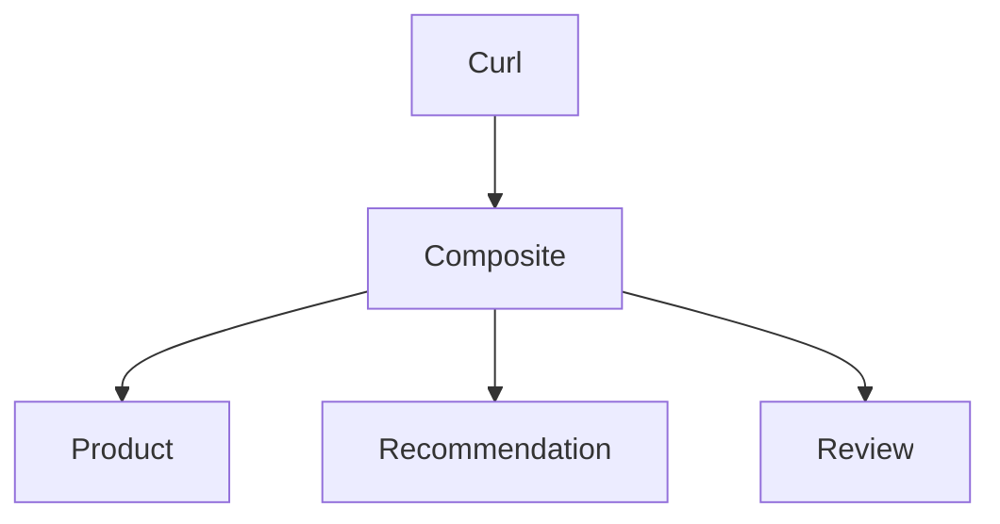

# 1. Overview



The Composite service calling the core services uses:
1. Using Virtual Threads with Structured Concurrency
1. Using `RestClient` and the new Interface based HTTP Client

Three variants:
1. `sequential` - Sequential with Interface Clients
1. `interface-client` - Concurrent with Interface Clients
1. `rest-client` - Concurrent with RestClients

> **NOTE:** For simplicity, one API Provider implements all three core services

# 2. Build, run, and test

Run each command in a separate terminal:

```
./gradlew api-provider:bootRun
./gradlew api-consumer:bootRun
time ./test-all-clients.bash
```

Test script:
* [test all client types](test-all-clients.bash)
* [test one client type](test-one-client.bash)


# 3. Code changes required by SB 4

See [Spring Boot 4.0 Migration Guide](https://github.com/spring-projects/spring-boot/wiki/Spring-Boot-4.0-Migration-Guide)

## 3.1. Fine grained dependencies

> **From [Modularizing Spring Boot](https://spring.io/blog/2025/10/28/modularizing-spring-boot):**
>
> _Each time we support something new, the autoconfigure jar grows. With Spring Boot 3.5, that single spring-boot-autoconfigure jar is now 2 MiB!_**

Spring Boot 4 breaks up the monolithic `spring-boot-autoconfigure` and `spring-boot-test-autoconfigure` jars, resulting in smaller and more focused modules. Intended goals are:
* Maintainability and architectural clarity 
* Reduced artifact sizes and footprint


Examples:

1. `RestCLient` and `WebCLient` no longer part of `spring-boot-starter-webmvc/webflux`, now they have their own starters
1. `@AutoConfigureWebTestClient` required to bind the `WebTestClient` to the test context.   
    It is no longer suffieicent to declare `@SpringBootTest(webEnvironment = RANDOM_PORT)` on the test class.
1. New test-dependencies required, e.g. `spring-boot-starter-webflux-test` and `spring-boot-starter-data-mongodb-test`
1. Package names follow the dependecy names more strictly, e.g. the class `DataMongoTest` is moved from:

       org.springframework.boot.test.autoconfigure.data.mongo
   To:

       org.springframework.boot.data.mongodb.test.autoconfigure


## 3.2. OpenRewrite to some help...

Not an expert in OpenRewrite, but I have compiled a Gradle init script to try out `org.openrewrite.java.spring.boot4.UpgradeSpringBoot_4_0`.

* [init.gradle](openrewrite-migrate-to-sb4-recipe/init.gradle)

Try it out:

```
git clone git@github.com:PacktPublishing/Microservices-with-Spring-Boot-and-Spring-Cloud-Fourth-Edition.git ms-sb-3.5
cd ms-sb-3.5/Chapter04
./gradlew --init-script ${PATH-TOSB4LABS}/openrewrite-migrate-to-sb4-recipe/init.gradle rewriteRun
```

Check changes:

``` bash
git status
On branch main
Your branch is up to date with 'origin/main'.

Changes not staged for commit:
  (use "git add <file>..." to update what will be committed)
  (use "git restore <file>..." to discard changes in working directory)
	modified:   api/build.gradle
	modified:   gradle/wrapper/gradle-wrapper.properties
	modified:   microservices/product-composite-service/build.gradle
	modified:   microservices/product-composite-service/src/main/java/se/magnus/microservices/composite/product/services/ProductCompositeIntegration.java
	modified:   microservices/product-composite-service/src/main/resources/application.yml
	modified:   microservices/product-service/build.gradle
	modified:   microservices/product-service/src/main/resources/application.yml
	modified:   microservices/recommendation-service/build.gradle
	modified:   microservices/recommendation-service/src/main/resources/application.yml
	modified:   microservices/review-service/build.gradle
	modified:   microservices/review-service/src/main/resources/application.yml
	modified:   util/build.gradle

Untracked files:
  (use "git add <file>..." to include in what will be committed)
	microservices/product-composite-service/src/main/resources/application-docker.yml
	microservices/product-service/src/main/resources/application-docker.yml
	microservices/recommendation-service/src/main/resources/application-docker.yml
	microservices/review-service/src/main/resources/application-docker.yml
```

Initial analysis of the result:

1. Compile fails
1. Doesn't remove unused try/catch for `IOException` in` ProductCompositeIntegration.getErrorMessage()`
1. Tests fails for product-service
   - Missed to add dependency to `testImplementation 'org.springframework.boot:spring-boot-webflux-test'` 
   - Missing to add the `@AutoConfigureWebTestClient` annotation
   - Failed to change contants that changed name, e.g. `UNPROCESSABLE_ENTITY` --> `UNPROCESSABLE_CONTENT`

**RESULT:** ...maybe I failed to find all open source receipts for migration to Spring Boot 4.0, but this result is fairly poor...

## 3.3. Migrating from Jackson v2 to v3

1. Package rename from `com.fasterxml.jackson` to `tools.jackson`
2. Replaced `ObjectMapper` with `JsonMapper`.
3. Fewer checked exceptions are thrown by v3.

# 4. Smaller jars?

Fine grained dependencies, smaller jars?
Does the fine grained dependencies result in smaller jars?

SB 4.0.0:

```
spring init \
--boot-version=4.0.0 \
--type=gradle-project \
--java-version=25 \
--packaging=jar \
--name=sb400 \
--dependencies=web \
sb400

cd sb400
sdk use java 25-tem
./gradlew build
ls -al build/libs/sb400-0.0.1-SNAPSHOT.jar
cd ..
```

Results in:

```
-rw-r--r--@ 1 magnus  staff  19616003 Dec 17 09:00 build/libs/sb400-0.0.1-SNAPSHOT.jar
```

SB 3.5.8:

```
spring init \
--boot-version=3.5.8 \
--type=gradle-project \
--java-version=21 \
--packaging=jar \
--name=sb358 \
--dependencies=web \
sb358

cd sb358
sdk use java 21.0.3-tem
./gradlew build
ls -al build/libs/sb358-0.0.1-SNAPSHOT.jar
```

Results in:

```
-rw-r--r--@ 1 magnus  staff  21044297 Dec 17 09:01 build/libs/sb358-0.0.1-SNAPSHOT.jar```
```

**Result:** Only dropped from 21 to 19 MB, a bit disappointing...

# 5. Java AOT Cache

Faster startup with Java AOT Cache, based on App CDS

Build jar-files:

```
./gradlew build
```

Start with plain jar-file:

```
java -jar api-provider/build/libs/api-provider-0.0.1-SNAPSHOT.jar
# Started ApiProviderApplication in 1.213 seconds (process running for 1.466)
```
AOT Cache with Java 24 commands:

```
# Create AOT Cache
java -XX:AOTMode=record -XX:AOTConfiguration=app.aotconf -Dspring.context.exit=onRefresh -jar api-provider/build/libs/api-provider-0.0.1-SNAPSHOT.jar
java -XX:AOTMode=create -XX:AOTConfiguration=app.aotconf -XX:AOTCache=app.aot -jar api-provider/build/libs/api-provider-0.0.1-SNAPSHOT.jar 

# Run with AOT Cache
java -XX:AOTCache=app.aot -jar api-provider/build/libs/api-provider-0.0.1-SNAPSHOT.jar 
# Started ApiProviderApplication in 0.813 seconds (process running for 0.997)
```

AOT Cache with Java 25 commands:

```
# Create AOT Cache
java -XX:AOTCacheOutput=app.aot -Dspring.context.exit=onRefresh -jar api-provider/build/libs/api-provider-0.0.1-SNAPSHOT.jar

# Run with AOT Cache
java -XX:AOTCache=app.aot -jar api-provider/build/libs/api-provider-0.0.1-SNAPSHOT.jar
# Started ApiProviderApplication in 0.824 seconds (process running for 1.019)
```

Build Pack + `BP_JVM_AOTCACHE_ENABLED: "true"` config in `build.gradle`.

* [api-provider/build.gradle](api-provider/build.gradle)

```
./gradlew bootBuildImage
docker images | grep sb4
```

Results in:
```
sb4labs/api-consumer:latest  d0f97ca63c82  375MB
sb4labs/api-provider:latest  fb05197921ab  359MB
```

Without `BP_JVM_AOTCACHE_ENABLED: "true"`:

```
docker run -p 8001:7001 sb4labs/api-provider
# Started ApiProviderApplication in 1.234 seconds (process running for 1.455)
```

With `BP_JVM_AOTCACHE_ENABLED: "true"`:

```
docker run -p 8001:7001 sb4labs/api-provider
# ...
# Spring AOT Cache Enabled, contributing -XX:AOTCache=application.aot to JAVA_TOOL_OPTIONS
# ...
# Started ApiProviderApplication in 0.547 seconds (process running for 0.7)
```

> **NOTE:**  Java AOT Cache is not the same as Spring AOT, see (and its limitations): https://docs.spring.io/spring-boot/reference/packaging/aot.html 

> **NOTE:** Watch out for libraries that connect during startup, e.g.:
> 
> 1. Prevent early database interaction
>    * https://github.com/spring-projects/spring-lifecycle-smoke-tests/blob/main/data/data-jpa
>    * https://github.com/spring-projects/spring-lifecycle-smoke-tests/tree/main/data/data-mongodb-reactive
>    * https://github.com/spring-projects/spring-lifecycle-smoke-tests/tree/main/data/data-mongodb
> 2. Clients of Spring Config Server looking for their configuration
> 3. OIDC (OAuth) Resource Servers resolving the Authorization Server's Discovery Endpoint
> 
> **Solution:** Where needed, create a Spring Profile used during Java AOT Cache training:
> 
> ```
> spring.config.activate.on-profile: aot-cache-training
> ```
> Configured in the Build Packs config, e.g.:
> ```
> TRAINING_RUN_JAVA_TOOL_OPTIONS: "-Dspring.profiles.active=aot-cache-training"
> ```

# 6. Null-safe application

An overview already covered in earlier presentations, now time for the details...

Background info:
* [Spring Framework 7 on null-safety](https://docs.spring.io/spring-framework/reference/core/null-safety.html)
* [Blog post 2025-03-10](https://spring.io/blog/2025/03/10/null-safety-in-spring-apps-with-jspecify-and-null-away)
* [Blog post 2025-11-12](https://spring.io/blog/2025/11/12/null-safe-applications-with-spring-boot-4)

1. Settings in `build.gradle`:
   * [api-provider/build.gradle](api-provider/build.gradle)
   * [api-consumer/build.gradle](api-consumer/build.gradle)


2. Every Java package needs its own `@NullMarked` annotation, puh...
   - A OpenRewrite Package Visitor to the resque:   
     (still under development...)
      ```java
       public class CreateNullMarkedPackagesVisitor extends JavaIsoVisitor<ExecutionContext> {
           private final JavaTemplate PackageInfoTemplate =
               JavaTemplate.builder(
               """
               @NullMarked
               package #{};
   
               import org.jspecify.annotations.NullMarked;
               """).build();
       }
      ```

    A lot of `package-info.java` files, all looking the same (except for the package name):
    * [package-info.java](api-consumer/src/main/java/se/magnus/sb4labs/apiconsumer/package-info.java)


3. Code changes:
   * Using `Objects.requireNonNull()` where a library (`RestClient`) can return `null`, but not the way I'm using it...   
     [ProductCompositeIntegration.java](api-consumer/src/main/java/se/magnus/sb4labs/apiconsumer/ProductCompositeIntegration.java)
   * Had to remove null checks in [ProductCompositeRestController.java](api-consumer/src/main/java/se/magnus/sb4labs/apiconsumer/ProductCompositeRestController.java)

# 7. Observability

Observability dependencies are now packaged into one single `OTel` starter dependnecy:

    implementation 'org.springframework.boot:spring-boot-starter-opentelemetry'

1. Enable tracing in `application.yml`:

       tracing.export.enabled: true

   * [consumer app-config](./api-consumer/src/main/resources/application.yaml)
   * [provider app-config](./api-provider/src/main/resources/application.yaml)


1. Start Jaeger for OpenTelemetry tracing

```
docker run -d --name jaeger \
  -p 16686:16686 \
  -p 4317:4317 \
  -p 4318:4318 \
  -p 5778:5778 \
  -p 9411:9411 \
  cr.jaegertracing.io/jaegertracing/jaeger:2.11.0
```

1. Restart the provider and consumer apps

Try out the three client types

```
curl localhost:7002/product-composite/sequential/2 -i
curl localhost:7002/product-composite/rest-client/2 -i
curl localhost:7002/product-composite/interface-client/2 -i
```

Check trace i Jaegers Web UI: http://localhost:16686

Results:
* [Sequential with RestClient](./docs/Jaeger-SpringBoot4-Sequential-RestClient.png)
* [Structured Concurrency](./docs/Jaeger-SpringBoot4-Structured-Concurrency-InterfaceClient.png)

**Conclusion:** Context propagation currently does not work with Structured Concurrency,   
see [Micrometer issue: Investigate Scoped Values](https://github.com/micrometer-metrics/context-propagation/issues/108)

Compare with WebFlux and Project Reactor: [Jaeger-SpringBoot4-WebFlux.png](./docs/Jaeger-SpringBoot4-WebFlux-InterfaceClient.png)

When done:

```
docker rm -f jaeger
```

## 7.1. More om problems with Micrometer and Structured Concurrency

1. Investigate Scoped Values: https://github.com/micrometer-metrics/context-propagation/issues/108
2. Discuss Structured Concurrency: https://github.com/micrometer-metrics/context-propagation/issues/419
3. micrometer observability for the new StructuredTaskScope api: https://github.com/micrometer-metrics/micrometer/issues/5761
4. https://www.unlogged.io/post/enhanced-observability-with-java-21-and-spring-3-2
5. proposed workarounds for programmatically propagate context:
    1. https://github.com/micrometer-metrics/micrometer/issues/5761#issuecomment-2580798283
    2. https://stackoverflow.com/questions/78889603/traceid-propagation-to-virtual-thread
    3. https://stackoverflow.com/questions/78746378/spring-boot-3-micrometer-tracing-in-mdc/78765658#78765658

> **Note: Compare with WebFlux and Project Reactor.**
>
> To propagate the [W3C Trace Context](https://www.w3.org/TR/trace-context/) is to specify
>
>     spring.reactor.context-propagation: AUTO

# 8. API versioning

API Version can be specified in either:

1. Path segment: `/api/v1/users` vs `/api/v2/users`
1. Request header: `X-API-Version: 1.0` vs` X-API-Version: 2.0`
1. Query parameter: `/api/users?version=1.0` vs `/api/users?version=2.0`
1. Media type parameter: `Accept: application/json;version=1.0` vs `Accept: application/json;version=2.0`

## 8.1. API Provider

1. [ApiVersionConfig.java](api-provider/src/main/java/se/magnus/sb4labs/apiprovider/ApiVersionConfig.java)
2. [ProductRestService.java](api-definitions/src/main/java/se/magnus/sb4labs/api/core/product/ProductRestService.java)
3. [RecommendationRestService.java](api-definitions/src/main/java/se/magnus/sb4labs/api/core/recommendation/RecommendationRestService.java)
4. [ReviewRestService.java](api-definitions/src/main/java/se/magnus/sb4labs/api/core/review/ReviewRestService.java)

## 8.2. API Consumer, based on a RestClient

1. [Configure RestClient in ApiConsumerApplication.java](api-consumer/src/main/java/se/magnus/sb4labs/apiconsumer/ApiConsumerApplication.java)
2. [Using RestClient in ProductCompositeIntegration.java](api-consumer/src/main/java/se/magnus/sb4labs/apiconsumer/ProductCompositeIntegration.java)

# 9. Interface HTTP clients

Evolved from [Spring Cloud OpenFeign](https://docs.spring.io/spring-cloud-openfeign/docs/current/reference/html/) 

**In essence:** Java interfaces annotated with `@HttpExchange`, and methods annotated with `@GetExchange`. Proxies are created for each interface, and can be used to call HTTP services.

1. [ProductClient.java](api-consumer/src/main/java/se/magnus/sb4labs/apiconsumer/interfaceclients/ProductClient.java)
2. [RecommendationClient.java](api-consumer/src/main/java/se/magnus/sb4labs/apiconsumer/interfaceclients/RecommendationClient.java)
3. [ReviewClient.java](api-consumer/src/main/java/se/magnus/sb4labs/apiconsumer/interfaceclients/ReviewClient.java)

Minimal configuration:

[Extract from InterfaceClientsConfig.java](api-consumer/src/main/java/se/magnus/sb4labs/apiconsumer/InterfaceClientsConfig.java):

``` java
@ImportHttpServices(group = "productGroup", types = ProductClient.class)
@ImportHttpServices(group = "recommendationGroup", types = RecommendationClient.class)
@ImportHttpServices(group = "reviewGroup", types = ReviewClient.class)
@Configuration
public class InterfaceClientsConfig {

  @Bean
  RestClientHttpServiceGroupConfigurer groupConfigurer() {
    return groups -> {
      groups.forEachClient((group, builder) -> {
        builder
          .defaultHeader("Accept", "application/json");
      });
    };
  }
```

[Extract from application.yaml](api-consumer/src/main/resources/application.yaml):

``` yaml
spring.http:serviceclient:
  
  productGroup:
    base-url: http://localhost:7001

  recommendationGroup:
    base-url: http://localhost:7001

  reviewGroup:
    base-url: http://localhost:7001
```

Usage in [ProductCompositeRestController.java](api-consumer/src/main/java/se/magnus/sb4labs/apiconsumer/ProductCompositeRestController.java):

``` java
  final private ProductClient productClient;

  public ProductCompositeRestController(ProductClient productClient) {
    this.productClient = productClient;
  }

  ProductAggregate getProduct(int productId) {
    var product = productClient.getProduct(productId);
  }
```

Eliminates the need of [ProductCompositeIntegration.java](api-consumer/src/main/java/se/magnus/sb4labs/apiconsumer/ProductCompositeIntegration.java), **GREAT!!!**

...but what about:
1. API Versioning?
2. Logging?
3. Error handling?
4. Resilience?
   1. Time Limiter
   2. Retry
   3. Circuit Breaker
5. Structured Concurrency?
6. Distributed Tracing?
7. Security?
8. GraalVM Native Compile?

> **NOTE:** Generic blog posts (more or less AI-generated...) don't cover this level of details, e.g., https://www.danvega.dev/blog/http-interfaces-spring-boot-4...

## 9.1. API Versioning?

[Additions in InterfaceClientsConfig.java](api-consumer/src/main/java/se/magnus/sb4labs/apiconsumer/InterfaceClientsConfig.java):

```
  @Bean
  RestClientHttpServiceGroupConfigurer groupConfigurer() {
    return groups -> {
      groups.forEachClient((group, builder) -> {
        builder
          .defaultHeader("Accept", "application/json")
          .apiVersionInserter(usePathSegment(0)) // ADDED FOR API VERSIONING
```

[Additions in application.yaml](api-consumer/src/main/resources/application.yaml):

```
    productGroup:
      base-url: http://localhost:7001
      apiversion.default: 1 # ADDED FOR API VERSIONING

    recommendationGroup:
      base-url: http://localhost:7001
      apiversion.default: 2 # ADDED FOR API VERSIONING

    reviewGroup:
      base-url: http://localhost:7001
      apiversion.default: 3 # ADDED FOR API VERSIONING
```

## 9.2. Logging?

[Additions in InterfaceClientsConfig.java](api-consumer/src/main/java/se/magnus/sb4labs/apiconsumer/InterfaceClientsConfig.java):

```
  @Bean
  RestClientHttpServiceGroupConfigurer groupConfigurer() {
    return groups -> {
      groups.forEachClient((group, builder) -> {
        builder
          .defaultHeader("Accept", "application/json")
          .apiVersionInserter(ApiVersionInserter.usePathSegment(0)) 
          .requestInterceptor(new LoggingInterceptor()); // ADDED FOR LOGGING
  ...
  
  private static class LoggingInterceptor implements ClientHttpRequestInterceptor {
    public ClientHttpResponse intercept(HttpRequest request, byte[] body, ClientHttpRequestExecution execution) throws IOException {

      LOG.info("""
        Performing request: {} {}
        Headers: {}
        """, request.getMethod(), request.getURI(), request.getHeaders());

      ClientHttpResponse response = execution.execute(request, body);

      LOG.info("""
        Response, status code: {}
        Headers: {}
        """, response.getStatusCode(), response.getHeaders());

      return response;
    }
  }
```

## 9.3. Error handling?

[Additions in InterfaceClientsConfig.java](api-consumer/src/main/java/se/magnus/sb4labs/apiconsumer/InterfaceClientsConfig.java):

```
  @Bean
  RestClientHttpServiceGroupConfigurer groupConfigurer() {
    return groups -> {
      groups.forEachClient((group, builder) -> {
        builder
          .defaultHeader("Accept", "application/json")
          .apiVersionInserter(ApiVersionInserter.usePathSegment(0)) 
          .defaultStatusHandler(this::shallErrorBeHandled, this::handleError) // ADDED FOR LOGGING
          .requestInterceptor(new LoggingInterceptor());
  ...

  private boolean shallErrorBeHandled(HttpStatusCode status) {
    if (status.isError()) LOG.warn("Checking an HTTP error: {}", status.value());
    return status.isSameCodeAs(NOT_FOUND) || status.isSameCodeAs(UNPROCESSABLE_CONTENT);
  }

  private void handleError(HttpRequest request, ClientHttpResponse response) throws IOException {

    switch (response.getStatusCode()) {
      case NOT_FOUND:
        LOG.warn("Got an NOT_FOUND HTTP error response");
        throw new NotFoundException(getErrorMessage(response));
      case UNPROCESSABLE_CONTENT:
        LOG.warn("Got an UNPROCESSABLE_CONTENT HTTP error response");
        throw new InvalidInputException(getErrorMessage(response));
      default:
        LOG.warn("Got an unexpected HTTP error: {}...", response.getStatusCode().value());
        throw new IllegalStateException("Unexpected HTTP error: " + response.getStatusCode().value());
    }
  }
```

## 9.4. Resilience?

Focus on time limiter, retry, and circuit breaker.

Alternatives:

1. Resilience4J
2. Spring Cloud Circuit Breaker
3. NEW in Spring Framework 7: ConcurrencyLimit and Retryable

Since a **Circuit Breaker** is the most important resilience feature in my mind, I chose Spring Cloud Circuit Breaker, using Resilience4J as the underlying library.

Spring Cloud Circuit Breaker comes with builtin support for Interface clients using `@HttpServiceFallback` annotations, lacking in Resilience4J.

1. [ProductClientFallbackConfig.java](api-consumer/src/main/java/se/magnus/sb4labs/apiconsumer/interfaceclients/resilience/ProductClientFallbackConfig.java)
2. [ProductFallbacks.java](api-consumer/src/main/java/se/magnus/sb4labs/apiconsumer/interfaceclients/resilience/ProductFallbacks.java)
3. [GetProductFallback.java](api-consumer/src/main/java/se/magnus/sb4labs/apiconsumer/interfaceclients/resilience/GetProductFallback.java)
4. [Config of Resilience4J in application.yaml](api-consumer/src/main/resources/application.yaml)

## 9.5. Structured Concurrency?

Works out of the box. See `getProductWithInterfaceClients()` in:
* [ProductCompositeRestController.java](api-consumer/src/main/java/se/magnus/sb4labs/apiconsumer/ProductCompositeRestController.java)

## 9.6. Distributed Tracing?

**WORK IN PROGRESS**: Works out of the box, the underlying HTTP client (i.e., RestProxy or WebProxy) handles the W3C Context propagation. See `getProductSequential()` in:
* [ProductCompositeRestController.java](api-consumer/src/main/java/se/magnus/sb4labs/apiconsumer/ProductCompositeRestController.java)

## 9.7. Security?

No autoconfiguration for OAuth in place yet!

Track progress in: [Issue #46956: Add Autoconfiguration for OAuth2 + Interface HTTP Clients](https://github.com/spring-projects/spring-boot/issues/46956)

## 9.8. GraalVM Native Compile?

**TODO:** Not yet tested...

# 10. Spring Data AOT Repositories

Based on Spring AOT, i.e. making a closed-world assumption and generate code for Spring Data repositories at build time.   
See [Spring Framework: Ahead of Time Optimizations](https://docs.spring.io/spring-framework/reference/core/aot.html).

Spring Data Ahead of Time Repositories...

See:

1. Blog post #1: https://spring.io/blog/2025/05/22/spring-data-ahead-of-time-repositories
2. Blog post #2: https://spring.io/blog/2025/11/25/spring-data-ahead-of-time-repositories-part-2
3. Code example: https://github.com/spring-projects/spring-data-examples/tree/main/jpa/aot-optimization

**Notes:**

1. Does not support reactive JPA repositories.
2. Requires AOT compilation.
   * **TODO:** See examples of extra config required due AOT in CH23 of the MS-book.
     See https://docs.spring.io/spring-boot/how-to/aot.html#howto.aot.conditions

From [my book, 4rt ed, Chapter 23](https://github.com/PacktPublishing/Microservices-with-Spring-Boot-and-Spring-Cloud-Fourth-Edition/blob/main/Chapter23/microservices/product-composite-service/src/main/resources/application.yml)

```
# Required to make the Spring AOT engine generate the appropriate infrastructure for a separate management port, prometheus and K8S probes at build time
management.server.port: 9009

# Required to make the Spring AOT engine generate a ReactiveJwtDecoder for the OIDC Issuer
spring.security.oauth2.resourceserver.jwt.issuer-uri: http://someissuer
```
