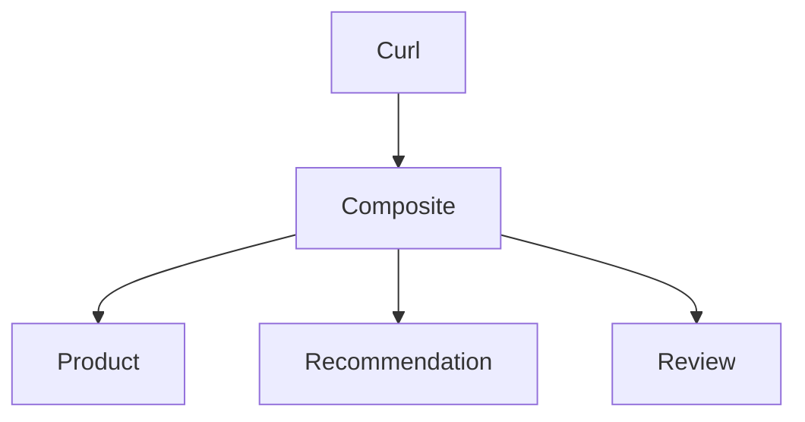

# Overview



The Composite service calling the core services uses:
1. Using Virtual Threads with Structured Concurrency
1. Using Interface Clients and RestClients

Three variants:
1. `sequential` - Sequential with Interface Clients
1. `interface-client` - Concurrent with Interface Clients
1. `rest-client` - Concurrent with RestClients

> **NOTE:** For simplicity, one API PRovider implementans all three core services

# Build, run, and test

Run each command in a separate terminal:

```
./gradlew api-provider:build -x test && java -jar api-provider/build/libs/api-provider-0.0.1-SNAPSHOT.jar

./gradlew api-consumer:build -x test && java --enable-preview --enable-native-access=ALL-UNNAMED -jar api-consumer/build/libs/api-consumer-0.0.1-SNAPSHOT.jar

./test-all-clients.bash
```

# Code changes

See https://github.com/spring-projects/spring-boot/wiki/Spring-Boot-4.0-Migration-Guide#starters

## Fine grained deps

E.g.:

1. `RestCLient` and `WebCLient` no longer part of `spring-boot-starter-webmvc/webflux`, now they have their own starters
1. `@AutoConfigureWebTestClient` required to bind the `WebTestClient` to the test context.   
    It is no longer suffieicent to declare `@SpringBootTest(webEnvironment = RANDOM_PORT)` on the test class.
1. New test-dependencies required, e.g. `spring-boot-starter-webflux-test` and `spring-boot-starter-data-mongodb-test`
1. Package names follow the dependecy names more strictly, e.g. the class `DataMongoTest` is moved from:

       org.springframework.boot.test.autoconfigure.data.mongo
   To:

       org.springframework.boot.data.mongodb.test.autoconfigure
1. OTel et al dependencies are now part of a single dependency `spring-boot-starter-opentelemetry`

## OpenRewrite to some help...

**TODO:** Try out on public repo for 4th edition
* Shortcomings: https://github.com/magnus-larsson/Microservices-with-Spring-Boot-and-Spring-Cloud-3E-INIT/issues/126#issuecomment-3810837234
* Files: /Users/magnus/Documents/projects/openrewrite/git/openrewrite-migrate-to-sb4/migrate-to-sb4-recipe/init.gradle
* Command:  ./gradlew --init-script migrate-to-sb4-recipe/init.gradle rewriteRun

## Migrating from Jackson v2 to v3

1. Package rename from `com.fasterxml.jackson` to `tools.jackson`
2. Replaced `ObjectMapper` with `JsonMapper`.
3. Fewer checked exceptions are thrown by v3.

# Faste startup with Java AOT Cache

...Java 25 AOT Cache, Build Packs

See https://github.com/magnus-larsson/Microservices-with-Spring-Boot-and-Spring-Cloud-3E-INIT/issues/113
See /Users/magnus/Documents/projects/cadec2026/SB4.0-bootcamp.pptx

Java 24 & 25 commands


BootBuildImage + config in build.gradle

Compare times with and without Docker...

> **NOTE:** Not the same as Spring AOT, see (and its limitations): https://docs.spring.io/spring-boot/reference/packaging/aot.html 

# Fine grained dependencies, smaller jars?

Does the fine grained dependencies result in smaller jars?

SB 4.0.0:

```
spring init \
--boot-version=4.0.0 \
--type=gradle-project \
--java-version=25 \
--packaging=jar \
--name=sb400 \
--dependencies=web \
sb400

cd sb400
sdk use java 25-tem
./gradlew build
ls -al build/libs/sb400-0.0.1-SNAPSHOT.jar
cd ..
```

Results in:

```
-rw-r--r--@ 1 magnus  staff  19616003 Dec 17 09:00 build/libs/sb400-0.0.1-SNAPSHOT.jar
```

SB 3.5.8:

```
spring init \
--boot-version=3.5.8 \
--type=gradle-project \
--java-version=21 \
--packaging=jar \
--name=sb358 \
--dependencies=web \
sb358

cd sb358
sdk use java 21.0.3-tem
./gradlew build
ls -al build/libs/sb358-0.0.1-SNAPSHOT.jar
```

Results in:

```
-rw-r--r--@ 1 magnus  staff  21044297 Dec 17 09:01 build/libs/sb358-0.0.1-SNAPSHOT.jar```
```

**Result:** Only dropped from 21 to 19 MB...

# Observability

Dependency:

    implementation 'org.springframework.boot:spring-boot-starter-opentelemetry'

1. Enable tracing in `application.yml`:

       tracing.export.enabled: true

   * [consumer app-config](./api-consumer/src/main/resources/application.yaml)
   * [provider app-config](./api-provider/src/main/resources/application.yaml)


1. Start Jaeger for OpenTelemetry tracing

```
docker run -d --name jaeger \
  -p 16686:16686 \
  -p 4317:4317 \
  -p 4318:4318 \
  -p 5778:5778 \
  -p 9411:9411 \
  cr.jaegertracing.io/jaegertracing/jaeger:2.11.0
```

1. Restart the provider and consumer apps

Try out the three client types

```
curl localhost:7002/product-composite/sequential/2 -i
curl localhost:7002/product-composite/rest-client/2 -i
curl localhost:7002/product-composite/interface-client/2 -i
```

Check trace i Jaegers Web UI: http://localhost:16686

**Conslusion:** Context propagation currently does not work with Structured Concurrency,   
see [Micrometer issue: Investigate Scoped Values](https://github.com/micrometer-metrics/context-propagation/issues/108)

Compare with WebFLux and Project Reactor: [Jaeger-SpringBoot4-WebFlux.png](./docs/Jaeger-SpringBoot4-WebFlux.png)

When done:

```
docker rm -f jaeger
```

## Problems with Micrometer and Structured Concurrency:

1. Investigate Scoped Values: https://github.com/micrometer-metrics/context-propagation/issues/108
2. Discuss Structured Concurrency: https://github.com/micrometer-metrics/context-propagation/issues/419
3. micrometer observability for the new StructuredTaskScope api: https://github.com/micrometer-metrics/micrometer/issues/5761
4. https://www.unlogged.io/post/enhanced-observability-with-java-21-and-spring-3-2
5. proposed workarounds for programmatically propagate context:
    1. https://github.com/micrometer-metrics/micrometer/issues/5761#issuecomment-2580798283
    2. https://stackoverflow.com/questions/78889603/traceid-propagation-to-virtual-thread
    3. https://stackoverflow.com/questions/78746378/spring-boot-3-micrometer-tracing-in-mdc/78765658#78765658

> **Note: Compare with WebFlux and Project Reactor.**
>
> To propagate the [W3C Trace Context](https://www.w3.org/TR/trace-context/) is to specify
>
>     spring.reactor.context-propagation: AUTO

# API versioning

## Provider config

* [Open file](./settings.gradle)
* [java test](./api-consumer/src/test/java/se/magnus/sb4labs/apiconsumer/ApiConsumerApplicationTests.java)
* [clientInterface](./api-consumer/src/main/java/se/magnus/sb4labs/apiconsumer/InterfaceClientsConfig.java)
```java
@Configuration
public class ApiVersionConfig implements WebMvcConfigurer {

  @Override
  public void configureApiVersioning(ApiVersionConfigurer configurer) {
    configurer
      .usePathSegment(0)  // Index of the path segment containing version
      .addSupportedVersions("1.0", "2.0")
      .setDefaultVersion("1.0");
  }
}
```

```java
@GetMapping(
value = "/{version}/product/{productId}",
version = "1",
produces = "application/json")
Product getProduct(@PathVariable int productId);
```

## Consumer config, RestClient

```java
  @Bean
  RestClient restClient() {
    return RestClient.builder().
      apiVersionInserter(ApiVersionInserter.usePathSegment(0)).
      build();
  }
```

```java
      Product product = restClient.get()
        .uri(url)
        .apiVersion("1")
        ...
```

## Consumer config, with Interface clients

No problem.

# Interface clients

1. OK - API Versioning 
2. OK - Structured Concurrency
3. OK - Config of interface clients per API   
   See ~/Documents/projects/books/5th/git/labs/interface-clients-springio-2025-demo-rstoyanchev/api-service/src/main/resources/application.yml
5. OK - OpenTelemetry - Tracing   
   See `ProductCompositeRestController.getProductSequential`
3. Error handling  
   ```
   curl localhost:7001/1/product/-1 -i
   curl localhost:7001/1/product/13 -i

   curl localhost:7002/product-composite/interface-client/-3 -i

   HTTP/1.1 422
   Content-Type: application/json
   Transfer-Encoding: chunked
   Date: Sun, 04 Jan 2026 14:47:01 GMT

   {"timestamp":"2026-01-04T15:47:01.057647+01:00","path":"/product-composite/interface-client/-3","status":422,"error":"Unprocessable Content","message":"Invalid productId: -3"}%            

   curl localhost:7002/product-composite/interface-client/13 -i

   HTTP/1.1 404
   Content-Type: application/json
   Transfer-Encoding: chunked
   Date: Sun, 04 Jan 2026 14:47:42 GMT

   {"timestamp":"2026-01-04T15:47:42.391106+01:00","path":"/product-composite/interface-client/13","status":404,"error":"Not Found","message":"No product found for productId: 13"}%
   ```
4. Circuit Breaker, Retry, and Timeout

   Spring or Resilience4J?   
   Start with Resilience4J!

   * https://docs.spring.io/spring-cloud-circuitbreaker/docs/current/reference/html/spring-cloud-circuitbreaker-resilience4j.html
   * https://resilience4j.readme.io/docs/circuitbreaker

   **TODO**: Timeout ger 500 fel, kan man fånga timeout fel och skicka det vidare istället???

   ``` 
   alias ml-cb='clear; while true; do r=$(curl http://localhost:7002/actuator/circuitbreakers -s | jq -r .circuitBreakers.productGroup.state); sleep 1; clear; echo $r; done'
   alias ml-health='clear; while true; do r=$(curl http://localhost:7002/actuator/health -s | jq -r .status); sleep 1; clear; echo $r; done'
   ```
   
   Verify CB functionality:

   ```
   ./test-one-client.bash
   IMPL=sequential ./test-one-client.bash
   ```

10. Logging
11. Security

# Resilience

## FaultRate

```
curl 'http://localhost:7001/1/faultrate?probability=75' -X PUT
curl http://localhost:7001/1/faultrate
```

## Retryable

## CircuitBreaker

See `Interface clients`!

## ConcurrencyLimit

# Spring Data Ahead of Time Repositories

See:

1. Blog post #1: https://spring.io/blog/2025/05/22/spring-data-ahead-of-time-repositories
2. Blog post #2: https://spring.io/blog/2025/11/25/spring-data-ahead-of-time-repositories-part-2
3. Code example: https://github.com/spring-projects/spring-data-examples/tree/main/jpa/aot-optimization

**Notes:**

1. Does not support reactive JPA repositories.
2. Requires AOT compilation.
   * See examples of extra config required due AOT in CH23 of the MS-book.

# Tooling 

## Spring Dev Tools

See:

1. https://docs.spring.io/spring-boot/reference/using/devtools.html
1. https://www.baeldung.com/spring-boot-devtools
1. https://stackoverflow.com/questions/79306534/intellij-spring-boot-devtools-behavior

1. **IntelliJ Spring Debugger**...

```
dependencies {
    developmentOnly("org.springframework.boot:spring-boot-devtools")
}
```

In addition to installing spring-boot-devtools, you also need to enable automatic build in IntelliJ.

1. Open "Settings"
1. Select "Build, Execution, Deployment"
1. On the "Compiler" page, select "Build project automatically"

Also:

1. Open "Settings"
1. Select "Advanced settings"
1. In the "Compiler" section, select "Allow auto-make to start even if developed application is currently running"

## IntelliJ Junie AI Agent

Nice to run in brave mode given that tests exists or that tests are generated by the task

Many models are available: 

Open sith: `⌘,`

1. Models: Settings -> Tools -> Junie -> Models
2. BYOK: Settings -> Tools -> AI Assitent -> Models & API Keys

# TODO

Source: https://spring.io/blog/2025/09/02/road_to_ga_introduction

## resilience

## opentelemetry

## AOT Cache in Java 25

## Null safety + my open rewrite

## HTTP Service clients

* https://docs.spring.io/spring-boot/reference/io/rest-client.html#io.rest-client.httpservice
* https://docs.spring.io/spring-framework/reference/integration/rest-clients.html#rest-http-service-client

## Pkce SA Server

## Spring Data Aot repo

## Migrering & open rewrite

* https://www.moderne.ai/blog/speed-your-spring-boot-3-0-migration
* https://www.moderne.ai/community
* https://docs.openrewrite.org/recipe
* 
* s/java/spring/boot4
* https://docs.openrewrite.org/recipes/java/spring/boot4/upgradespringboot_4_0-community-edition
* https://docs.openrewrite.org/recipes/java/spring/boot4/upgradespringboot_4_0-moderne-edition
* https://docs.moderne.io/user-documentation/moderne-cli/getting-started/cli-intro/
* https://docs.moderne.io/user-documentation/moderne-platform/
 
# MISC...

Sample curl commands:

```
curl localhost:7002/thread-info

curl localhost:7001/1/product/1 -i
curl 'localhost:7001/2/recommendation?productId=1' -i
curl 'localhost:7001/3/review?productId=1' -i 
```